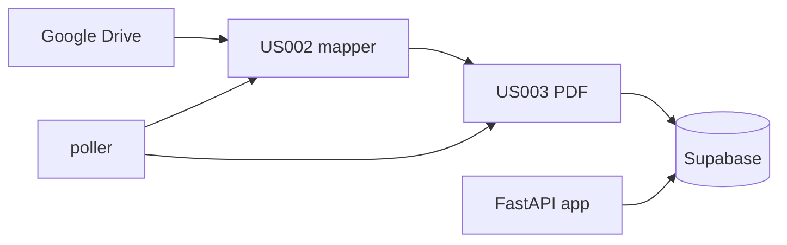

# CertiBot — Documentação técnica dos arquivos principais

Visão orientada a manutenção: o que cada módulo faz, dependências e fluxo de dados.

## Visão geral do fluxo

| Camada | Função |
|--------|--------|
| **US002** | Varre pastas no Drive e gera JSON com colaboradores, certificações e PDFs. |
| **US003** | Baixa PDFs, extrai texto/datas, opcionalmente grava no Supabase. |
| **poller** | Loop agendado: US002 → US003 → upsert Supabase + checkpoint incremental. |
| **api** | Chat: interpreta pergunta (`nlp`) e consulta Supabase (`supabase_query`). |

---

## Pacote `searchCertSystem/`

| Arquivo | Responsabilidade |
|---------|------------------|
| [`__init__.py`](../searchCertSystem/__init__.py) | Marca o diretório como pacote Python. |

---

## API — `searchCertSystem/api/`

| Arquivo | Responsabilidade |
|---------|------------------|
| [`app.py`](../searchCertSystem/api/app.py) | Aplicação FastAPI: `GET /` (UI do chat), `GET /health`, `POST /chat`. Carrega `.env`, resolve intenção com `parse_query`, faz match fuzzy de nome, monta resposta textual e links de evidência. |
| [`nlp.py`](../searchCertSystem/api/nlp.py) | **NLP baseado em regras**: normaliza texto (remove acentos para regex), detecta intenções (`list_all_active`, certificações por pessoa, quem tem certificado X, currículo, etc.). `best_match_person` usa RapidFuzz contra a lista de colaboradores do Supabase. |
| [`supabase_query.py`](../searchCertSystem/api/supabase_query.py) | Cliente **somente leitura** via PostgREST: consultas à view `v_certificacoes` (com fallback em join manual), aliases PO/SM, filtros de validade, currículos. |
| [`intents.py`](../searchCertSystem/api/intents.py) | Camada fina que delega para `nlp.parse_query` (compatibilidade). |

### Endpoints relevantes (`app.py`)

- `POST /chat`: corpo `{ "message": "..." }`; resposta com `answer`, `evidence[]`, `raw` opcional.
- `GET /`: HTML/CSS/JS do chat (fetch para `/chat`).

---

## Worker US002 — `searchCertSystem/worker/us002/`

| Arquivo | Responsabilidade |
|---------|------------------|
| [`drive_client.py`](../searchCertSystem/worker/us002/drive_client.py) | Cliente Google Drive API v3 **somente leitura** (Service Account): listar filhos de uma pasta (paginação), download de arquivo por `file_id`. |
| [`mapper.py`](../searchCertSystem/worker/us002/mapper.py) | Percorre `Raiz → Colaborador → Certificação → PDFs` (recursivo sob certificação). Produz estrutura JSON usada pelo US003 e pelo poller. |
| [`types.py`](../searchCertSystem/worker/us002/types.py) | Tipos auxiliares (`DriveFileDict`, `PdfLink`). |
| [`__main__.py`](../searchCertSystem/worker/us002/__main__.py) | CLI: executa o mapeamento e grava `output/us002.json` (ou caminho `--out`). |

---

## Worker US003 — `searchCertSystem/worker/us003/`

| Arquivo | Responsabilidade |
|---------|------------------|
| [`pdf_text.py`](../searchCertSystem/worker/us003/pdf_text.py) | Extrai texto de PDF com PyMuPDF; conta páginas. |
| [`date_extract.py`](../searchCertSystem/worker/us003/date_extract.py) | Regex PT/EN + heurísticas para datas de emissão/validade; saída BR e ISO. |
| [`drive_download.py`](../searchCertSystem/worker/us003/drive_download.py) | Usa `DriveClient.download_file_bytes` para obter bytes do PDF. |
| [`process_us002.py`](../searchCertSystem/worker/us003/process_us002.py) | Orquestra: para cada PDF do payload US002, baixa, extrai texto, datas, monta JSON consolidado (status ok/erro, debug opcional). |
| [`supabase_repo.py`](../searchCertSystem/worker/us003/supabase_repo.py) | Upserts PostgREST: `colaboradores`, `certificacoes`, `curriculos` (service role). |
| [`__main__.py`](../searchCertSystem/worker/us003/__main__.py) | CLI: lê `us002.json`, gera `us003.json`, opcional `--push-supabase`. |

---

## Poller — `searchCertSystem/worker/poller.py`

Orquestra um ciclo completo: mapear Drive → processar PDFs → persistir no Supabase. Mantém **checkpoint** JSON com `pdf_file_id` já processados para modo incremental. Detecta currículo na pasta do colaborador (nome do arquivo) e faz upsert em `curriculos`.

---

## Banco — `searchCertSystem/supabase/`

| Arquivo | Responsabilidade |
|---------|------------------|
| [`schema.sql`](../searchCertSystem/supabase/schema.sql) | DDL idempotente: tabelas `colaboradores`, `certificacoes`, `curriculos`, índices UNIQUE para upsert. |

*(Opcional no projeto: view `v_certificacoes` para simplificar leituras na API — criada manualmente no Supabase se usada.)*

---

## Configuração na raiz do projeto

| Arquivo | Uso |
|---------|-----|
| [`.env.example`](../.env.example) | Modelo de variáveis (sem segredos). |
| [`requirements.txt`](../requirements.txt) | Dependências pip. |
| [`README.md`](../README.md) | Uso operacional e setup. |

---

## Dependências entre módulos (resumo)

- `api.app` → `api.nlp`, `api.supabase_query`
- `worker.poller` → `us002.mapper`, `us003.process_us002`, `us003.supabase_repo`
- `us003.process_us002` → `us002.drive_client`, `us003.date_extract`, `us003.pdf_text`, `us003.drive_download`
- `us003.__main__` → `process_us002` + `supabase_repo`

---

## Convenções

- **PostgREST**: cabeçalhos `apikey` + `Authorization: Bearer <service_role>` para workers; mesma chave na API de leitura.
- **Nomes no chat**: comparação fuzzy contra `colaboradores.nome`; perguntas em PT com ou sem acentos após normalização em `nlp`.
